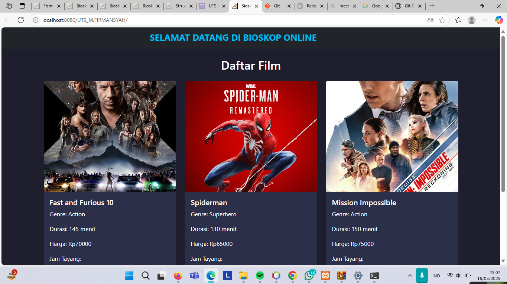
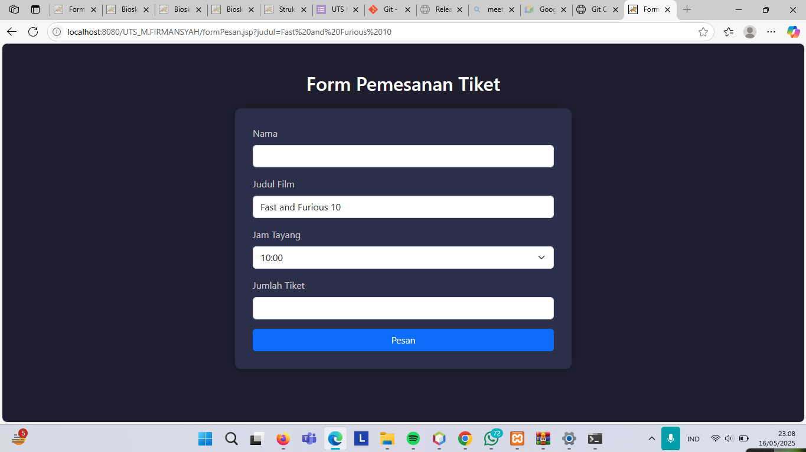
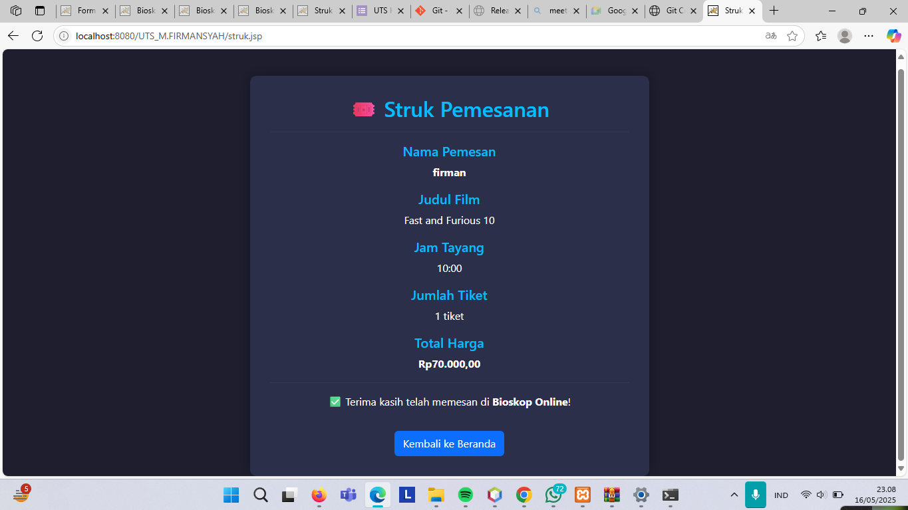

# 🎬 UTS_JSP_22110605_MFIRMANSYAH

## 📌 Deskripsi Project

Aplikasi Pemesanan Tiket Bioskop berbasis **JSP (Java Server Pages)** yang memungkinkan user untuk:

- Memilih film dan jam tayang dari daftar yang tersedia
- Mengisi form pemesanan secara interaktif
- Melihat ringkasan transaksi berisi:
  - Nama Pemesan
  - Film yang dipilih
  - Jam tayang
  - Jumlah tiket
  - Total harga

Data film dan jadwal disimpan menggunakan struktur `ArrayList`, dan seluruh proses dilakukan tanpa database (mengikuti ketentuan UTS).

---

## 🖼️ Screenshot Hasil Output

>   
> *tampilan menu utama*

> >   
> *Tampilan form pemesanan*

>   
> *Tampilan hasil transaksi akhir*

---

## 🚀 Cara Menjalankan Aplikasi

1. Clone repository ke lokal:
   ```bash
   git clone https://github.com/mfirmansyah-create/22110605_m.firmansyah_L2022.git

